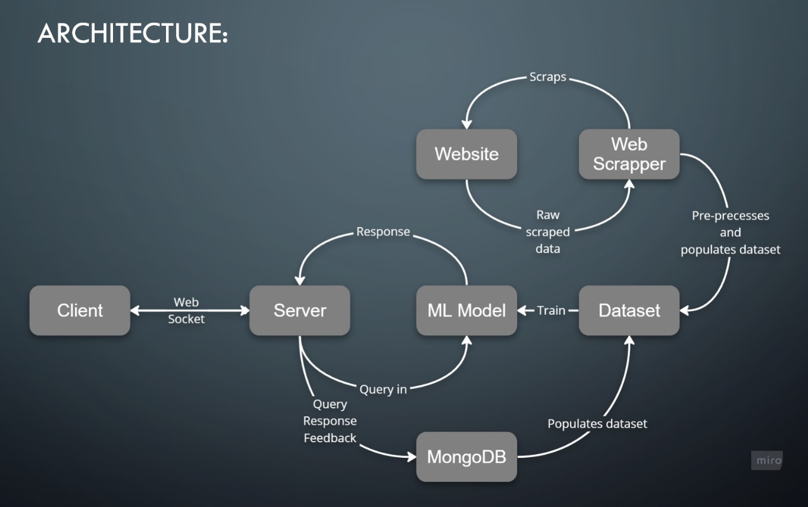
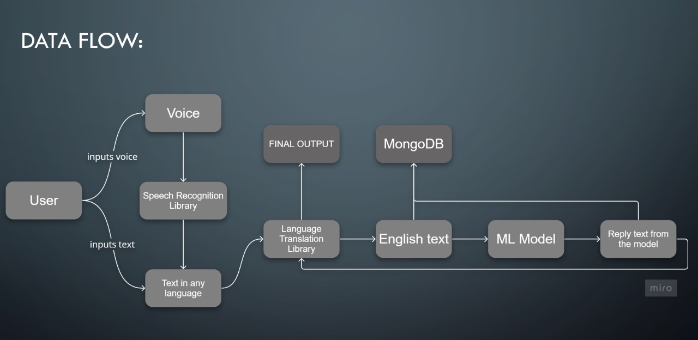

# The Debuggers

This repository serves as the dedicated space for our contributions to the Transfinitte Hackathon, where we've undertaken the project as part of the sponsored challenge presented by Netcon.

## The Problem Statement by Netcon
Create a cutting-edge NLP-based AI virtual assistant to interact with users. The goal is to develop a system that not only understands and responds to user queries but also provides a personalized experience. Incorporate voice recognition technology to enhance the assistant's ability to process spoken commands and questions.

## Demo Video, Presentation and ML Model:

Drive Link - [https://drive.google.com/drive/folders/1G2nFJJZfAxYumeBHswDUNPAl3IRBWSi1?usp=sharing](https://drive.google.com/drive/folders/1G2nFJJZfAxYumeBHswDUNPAl3IRBWSi1?usp=sharing)

## What it does

- Performs real-time tasks as a user-friendly virtual assistant.
- Understands and interprets user queries in various languages, including English, Tamil, and Hindi, providing accurate responses.
- Implements a feedback mechanism to gather user input for continuous enhancement of performance.

## Architecture

---


## Installation Guide

### Client
In the client directory, you can run:
#### Install dependencies: 
```npm install```

#### To Start Server:
```npm run dev``` 

#### To Visit App:
```localhost:3001```

### Server
In the Server directory, you can run:
#### Set up a virtual environment:
```
virtualenv -p python3 env
source ./venv/bin/activate
```

#### Install dependencies: 
```
pip install --upgrade pip
pip install -r requirements.txt
pip install farm-haystack[colab,inference]
```

### Download ML Model

Visit the given drive link and download the `dbert.pkl` and move it to `/server/app/nlp_engine/pickle/dbert.pkl`

#### To Start Server:
```python main.py``` 


## How we built it

`TheDebuggers_NC1` is a 3-tier application built with Flask, React, MongoDB, and Haystack pipeline. the following technologies were used for the application:

- React (Client-side Library)
- Flask (webserver/socket)
- MongoDB (database)
- Haystack (model)

## Model
- The model used is DistilBERT-base-uncased-distilled-squad which belongs to a class of transformers which works on BERT Architecture, available for open use on Hugging Face. 
- It has 40% less parameters than bert-base-uncased, runs 60% faster while preserving 97% of BERT's performances.
- DistilBERT is trained using knowledge distillation, a technique to compress a large model called the teacher into a smaller model called the student. By distillating Bert, we obtain a smaller Transformer model that bears a lot of similarities with the original BERT model while being lighter, smaller and faster to run. DistilBERT thus seems like an interesting option to put large-scaled trained Transformer model into production.

- Data Collection has been done using selenium and Beautiful Soup.Wrangled and pre-processed data contains FAQs about NetCon which has been used to Fine-Tune our NLP engine.

- ``F1  Score`` of the fine-tuned model is ``86.9``.


## Challenges we ran into

- Time constraints
- Choosing the right model
- Web scraping netcontechnology.com, filtering, preprocessing, and gaining valuable insights.
- Incorporating feedback mechanism


## Accomplishments that we're proud of

- Developed a fully functional, end-to-end chatbot application with an elegant user interface.
- Extracted data from the Netcon website to create a dataset containing 1080 question-answer pairs.
- Enabled both text and voice input options during interactions with the chatbot.
- Provided support for multiple languages for a more versatile user experience.

## What we learned

- Teamwork
- Idea pooling
- NLP
- Creativity
- Problem-Solving
- Feedback and Adaptation

## Future Goals

- Working on improving the accuracy of the model even futher, and optimizing the run time.
- Advanced Features: Explore the integration of advanced features such as sentiment analysis, personalized recommendations, or natural language generation for more dynamic interactions.
